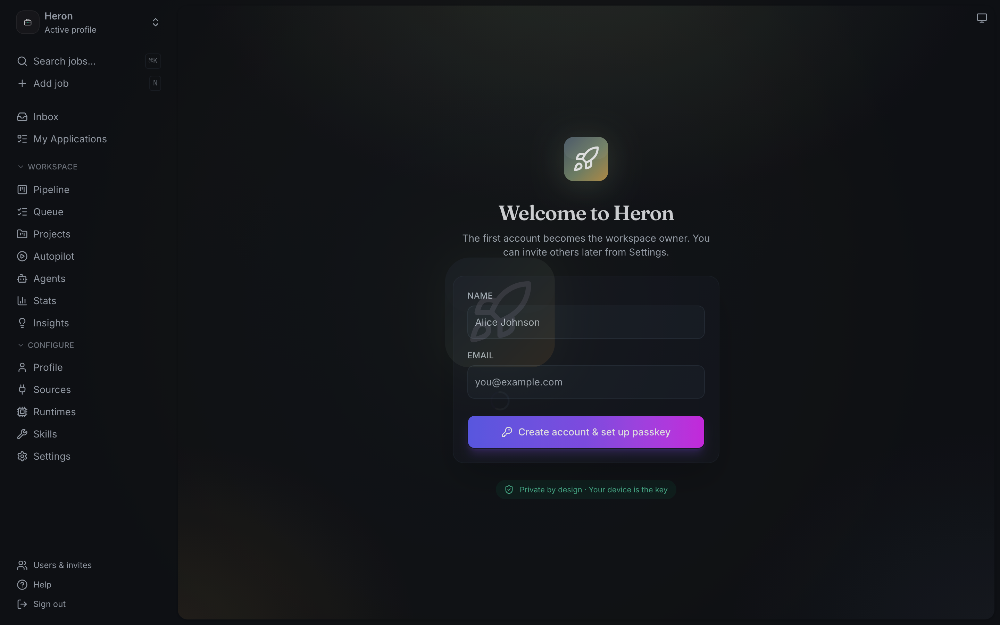
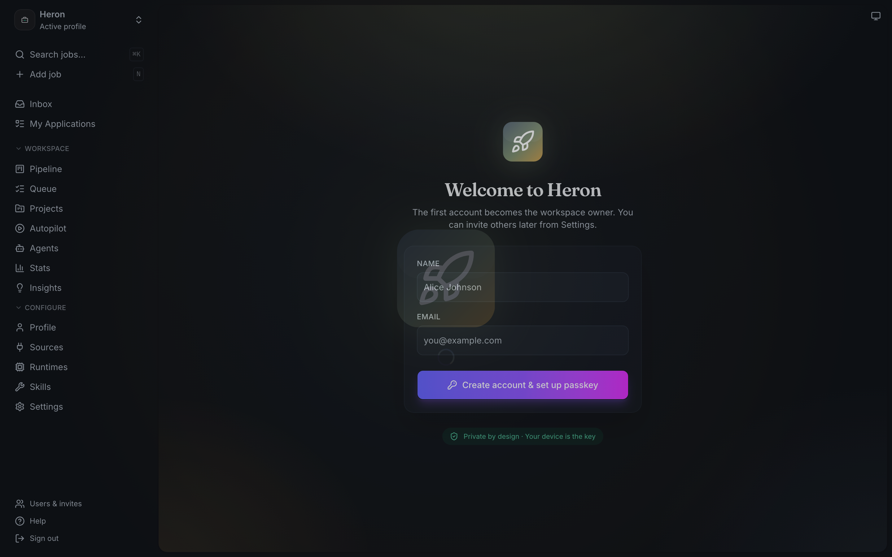
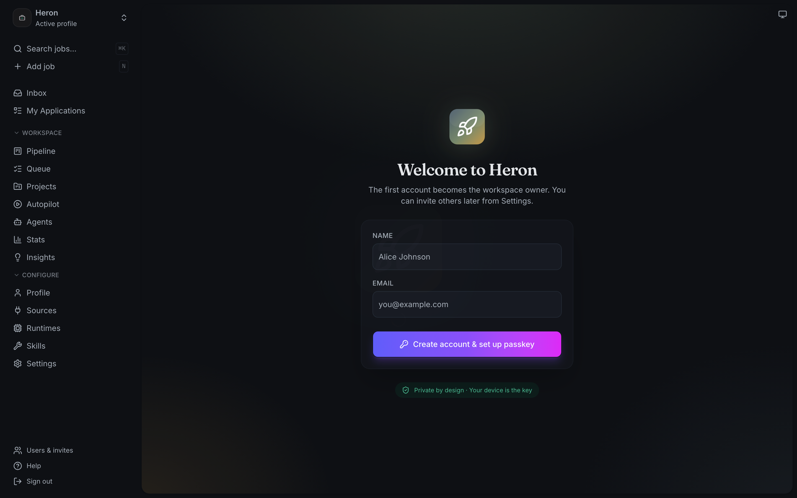
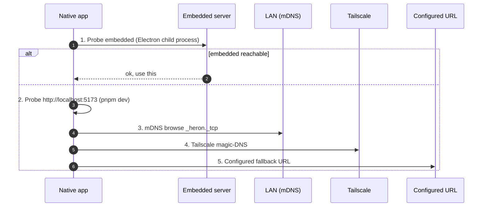

<div align="center">

<picture>
  <source media="(prefers-color-scheme: dark)" srcset="branding/assets/wordmark-light.svg">
  
</picture>

# Heron

<!-- AUTO-GENERATED:doc-meta -->
*Last revised 2026-05-19 · [Heron](https://heron.app) · Stand still. Strike well.*
<!-- /AUTO-GENERATED:doc-meta -->

**A thinking partner for career transitions. Local-first. Open source. AI-agnostic.**

[](https://github.com/heron/heron/actions/workflows/test.yml)
[](https://github.com/heron/heron/actions/workflows/codeql.yml)
[](https://codecov.io/github/heron/heron)
[](https://securityscorecards.dev/viewer/?uri=github.com/heron/heron)
[](LICENSE)
[](https://github.com/heron/heron/releases)
[](https://discord.gg/8pRpHETxa4)
[](https://reuse.software)

[**Quick start**](#quick-start) · [**Documentation**](docs/) · [**Architecture**](docs/ARCHITECTURE.md) · [**Discord**](https://discord.gg/8pRpHETxa4) · [**Sponsor**](https://github.com/sponsors/kaelys-js)

</div>

---

## What is Heron

The Heron stands motionless in shallow water. It waits. It watches. It evaluates every passing form. Then, when the moment is exactly right, it strikes — once, precisely, and the work is done.

This is the wrong era for spray-and-pray job searches. Recruiters' attention is finite. So is yours. Heron is a thinking partner for people in career transition who'd rather make one excellent move than fifty mediocre ones.

It runs entirely on your machine. Your data is yours.

## See it in action

<table>
  <tr>
    <td width="50%">
      <picture>
        <source media="(prefers-color-scheme: dark)" srcset="docs/screenshots/inbox-dark.png">
        
      </picture>
      <p align="center"><b>Inbox</b> — triaged opportunities by score</p>
    </td>
    <td width="50%">
      <picture>
        <source media="(prefers-color-scheme: dark)" srcset="docs/screenshots/evaluation-dark.png">
        
      </picture>
      <p align="center"><b>A–F evaluation</b> — six-block analysis per role</p>
    </td>
  </tr>
  <tr>
    <td><p align="center"><b>Autopilot</b> — score-gated automation, opt-in</p></td>
    <td><p align="center"><b>Patterns</b> — rejection-pattern insights</p></td>
  </tr>
  <tr>
    <td><p align="center"><b>Interview prep</b> — STAR+R stories from real projects</p></td>
    <td><p align="center"><b>Mobile</b> — iOS / Android via Capacitor</p></td>
  </tr>
</table>

> Screenshots not rendering? Run `pnpm screenshots` against a `pnpm dev` instance to regenerate. PNGs land under `docs/screenshots/`.

## What it does

| Capability | What you get | Where in product |
|---|---|---|
| **Pipeline tracking** | Every opportunity in one place — status, score, comp, notes. Multi-profile if you're running parallel career tracks. | `/inbox`, `/queue` |
| **A–F evaluation** | Six-block analysis per role: role-fit, CV match, level strategy, comp research, CV-personalization plan, interview prep. | `/job/[id]/report` |
| **CV generation** | ATS-optimized PDFs (HTML + LaTeX templates), tailored per role. AI-detect + ATS-keyword check built-in. | `/job/[id]/cv` |
| **Portal scanning** | 11 ATSes: Greenhouse, Ashby, Lever, LinkedIn, Indeed, Workday, Recruitee, SmartRecruiters, Workable, Personio, Teamtailor. | `/sources`, `pnpm scan` |
| **Recruiter inbound** | Email classifier flags offers, confirms interviews, reacts to rejections. Gmail IMAP poller built-in. | `/inbox` |
| **Interview prep** | STAR+R stories from your real projects; mock interviews; comp negotiation playbook. | `/job/[id]/prep` |
| **Autonomous apply** | Opt-in, score-gated, off by default. LinkedIn Easy Apply / Greenhouse / Ashby in prod; more stubbed. | `/autopilot` |
| **Multi-user + multi-profile** | Two humans share one install fully segregated. One human runs engineer + instructor profiles fully segregated. | `/settings/users`, profile switcher |
| **AI-agnostic** | Swappable CLI: Claude / Gemini / Codex / OpenCode / Qwen / Copilot. No vendor lock-in. | `AGENT_CLI=` env var |
| **Native everywhere** | iOS / Android via Capacitor, Electron desktop (Mac/Win/Linux), Apple Watch widget bundle. | `pnpm setup:native` |

## Why local-first

Your CV, application history, scoring data, recruiter emails, interview prep — all of it stays on your disk. No cloud aggregator. The AI runs locally or against an API key you own; the data never leaves your machine.

If a hosted tier emerges in the future, the open-source local-first version stays maintained and supported. That's the whole posture.

## Pricing

Heron is MIT-licensed and free. There is no hosted tier today.

| Cost | When |
|---|---|
| **$0/month, forever** | Default. Run locally, use your own AI subscriptions. |
| AI API tokens | If you use Anthropic / Gemini / OpenAI API keys directly. With a Claude Max plan via `AGENT_CLI=claude`, this is **$0**. |
| Apple Developer Program $99/yr | Only if you want to ship native iOS builds yourself. Default install uses the web dashboard + Electron desktop. |

The math: Heron saves a week of job-search time per role. That's worth far more than the AI tokens it costs to run. Local-first means you keep the savings.

## Quick start

<details open><summary><b>macOS / Linux</b></summary>

```bash
brew install mise gh                              # one-time, if not installed
gh repo clone heron/heron && cd heron
mise install                                      # Node 26 + pnpm 11 + Ruby 3.3 + Python 3.13
pnpm install                                      # one-shot install across workspaces
pnpm setup:native                                 # optional — Capacitor iOS/Android/Electron setup
pnpm dev                                          # SvelteKit dashboard at localhost:5173
```

</details>

<details><summary><b>Windows</b></summary>

```powershell
scoop install mise gh                              # via Scoop
gh repo clone heron/heron; cd heron
mise install                                       # Node 26 + pnpm 11 + Ruby 3.3 + Python 3.13
pnpm install
pnpm setup:native                                  # optional
pnpm dev                                           # SvelteKit dashboard at localhost:5173
```

</details>

See [`docs/SETUP.md`](docs/SETUP.md) for the long form including Capacitor / iOS / Apple Watch builds, fastlane signing, and the `pnpm doctor:native` preflight check.

## Architecture

The dashboard is a single SvelteKit app. The native apps are the same SvelteKit codebase wrapped in Capacitor (iOS / Android) or Electron (desktop). Backend discovery is hands-off — your phone, watch, and laptop reconcile to whichever Heron instance is reachable without configuration.



The full architecture — multi-user data layout, security posture, evaluation pipeline, autonomous-apply flow — is in [`docs/ARCHITECTURE.md`](docs/ARCHITECTURE.md).

<details><summary><b>Tech stack</b></summary>

| Layer | Tech |
|---|---|
| Dashboard UI | SvelteKit 2 + Tailwind 4 + bits-ui + Svelte 5 runes |
| Auth | Better Auth 1.6 + passkey + GitHub OAuth + invite codes (RBAC) |
| DB | Drizzle ORM + better-sqlite3 (WAL mode); `auth.db` + `app.db` |
| AI | Anthropic SDK + Google Gemini SDK + any CLI via `AGENT_CLI` |
| Portal scrape | Playwright 1.60 + direct ATS APIs (zero AI tokens on scan) |
| Desktop | Electron 39 + electron-builder + auto-update (Squirrel/Mac, Squirrel.Win, AppImage) |
| Mobile | Capacitor 8 (iOS + Android) + Swift Package Manager |
| Watch | WKApplication + WCSession + WidgetBundle |
| iOS widgets | 4 widgets (pipeline / next interview / top apply / inbox issues) |
| Build | mise + pnpm workspace + turborepo + biome + lefthook |
| CI | GitHub Actions on `macos-15`, `ubuntu-latest`, `windows-latest`; `act` for local |
| Release | Conventional Commits → release-please → native-release.yml → TestFlight + GitHub Release |

</details>

<details><summary><b>Repository layout</b></summary>

```text
heron/
├── README.md                    # ← you are here
├── CHANGELOG.md                 # Release-Please-managed
├── AGENTS.md / CLAUDE.md / GEMINI.md  # Agent + human entry points
├── ui/                          # SvelteKit dashboard + Capacitor iOS/Android/Electron
│   ├── src/                     # routes/, lib/server/, lib/client/, lib/components/, hooks.server.ts
│   ├── e2e/                     # Playwright end-to-end smoke tests
│   ├── ios/                     # Capacitor iOS app + Watch + 3 extensions
│   ├── android/                 # Capacitor Android app
│   └── electron/                # Capacitor-Electron shell (workspace)
├── scripts/                     # apply, scan, cv, quality, tracker, native, system, lib
├── modes/                       # AI skill modes (oferta, apply, scan, batch, …)
├── docs/                        # ARCHITECTURE, SETUP, TESTING, NATIVE, DATA_CONTRACT, GOVERNANCE, …
├── branding/                    # brand.json (SSOT) + logo.svg + wordmark variants
├── data/                        # Per-user runtime state (gitignored)
└── .github/                     # Workflows, issue/PR templates, CODEOWNERS, rulesets
```

</details>

## FAQ

<details><summary><b>How much does this cost to run?</b></summary>

$0/month if you use a Claude Max plan (`AGENT_CLI=claude` routes through `claude -p`). Otherwise: only the AI tokens for evaluations + CV generations, billed by your chosen provider. See [Pricing](#pricing).

</details>

<details><summary><b>Does this auto-apply to jobs?</b></summary>

Only if you opt in. Autopilot mode is **off by default**, score-gated (≥4.0/5 minimum), capped at a daily limit you set, and gracefully falls back to "manual apply needed" the moment anything looks off. See [`AGENTS.md` § "Ethical Use"](AGENTS.md#ethical-use--critical) for the full posture. Heron is a decision-support tool, not a spam bot.

</details>

<details><summary><b>Does my data leave my machine?</b></summary>

No — except for the AI API calls **you initiate** to your chosen provider (Anthropic / Gemini / OpenAI). Even those carry only the JD + prompt + your CV/profile that the AI needs to answer. No telemetry, no aggregator, no third-party uploads. Your `data/` directory is local-only and gitignored.

</details>

<details><summary><b>Can I use Claude Max instead of API tokens?</b></summary>

Yes. Set `AGENT_CLI=claude` (the default) and Heron uses `claude -p` for every AI call. Your Max plan covers it. No API key required.

</details>

<details><summary><b>Do I need a Mac for iOS builds?</b></summary>

Yes — code-signing requires macOS + Xcode. Linux / Windows still work for the web dashboard + Electron desktop + Android. The CI pipeline `native-release.yml` runs the iOS leg on `macos-15`; local iOS dev needs Xcode 16+.

</details>

<details><summary><b>Why not just use LinkedIn Easy Apply?</b></summary>

Easy Apply maximizes volume. Heron maximizes signal. Easy Apply submits a generic CV to 50 roles; Heron sends a tailored CV to 5 roles that actually fit. See [Comparable tools](#comparable-tools) below.

</details>

<details><summary><b>What ATSes are supported?</b></summary>

11 directly: Greenhouse, Ashby, Lever, LinkedIn, Indeed, Workday, Recruitee, SmartRecruiters, Workable, Personio, Teamtailor. Custom ATSes via the generic apply-portal stub (~50 LOC per new portal).

</details>

<details><summary><b>Is this a job board?</b></summary>

No. Heron is a workflow + decision-support layer. It consumes from job boards (LinkedIn / Indeed / The Muse / HN / RemoteOK / WWR / WelcomeToTheJungle) + ATS APIs you're already using. It doesn't host listings.

</details>

## Comparable tools

| Tool | Type | What Heron is different about |
|---|---|---|
| **JobScan** | Hosted SaaS | Resume keyword matching only. Heron does role evaluation, comp research, interview prep, and is local-first. |
| **Teal** | Hosted SaaS | Pipeline tracking on their servers. Heron tracks on your disk. |
| **ResumeWorded** | Hosted SaaS | Generic resume score. Heron tailors per-role with a personalization plan (Block E of the evaluation). |
| **Otta / WelcomeToTheJungle** | Job board | Discovery, not workflow. Heron consumes their RSS / scrapes once you're past discovery. |
| **AIHawk / Apply.ninja / LazyApply** | Auto-submit bots | Volume over quality. Heron explicitly refuses this category (see CONTRIBUTING § "What we do NOT accept"). |
| **`santifer/career-ops` (upstream)** | OSS CLI | Original. Heron adds multi-user, native apps, dashboard, autonomous-apply, Watch. See [Acknowledgements](#acknowledgements). |

## Community

| Channel | Use for |
|---|---|
| 💬 [Discord](https://discord.gg/8pRpHETxa4) | Real-time questions, setup help, show-and-tell — typically same-day during EU/US working hours |
| 📚 [GitHub Discussions](https://github.com/heron/heron/discussions) | Async Q&A + ideas + roadmap + success stories |
| 🐛 [Issues](https://github.com/heron/heron/issues) | Bugs + feature requests (use the templates) |
| 🎓 [I got hired](https://github.com/heron/heron/issues/new?template=i-got-hired.yml) | Tell the Hall of Fame your story |
| 📰 [Press kit](branding/PRESS.md) | Pre-written boilerplate for journalists + bloggers |
| 🔒 [Security disclosure](.github/SECURITY.md) | Private vulnerability reporting (NOT public issues) |

See [`.github/SUPPORT.md`](.github/SUPPORT.md) for the "where should I ask this?" routing matrix.

## Development

Daily commands:

```sh
pnpm dev                    # SvelteKit dev server (vite + HMR)
pnpm check                  # svelte-check + tsgo, turbo-cached
pnpm format                 # biome + prettier-svelte, in-place
pnpm test                   # full Vitest matrix
pnpm --filter ui test:e2e   # Playwright E2E smoke
pnpm --filter ui size       # bundle-size budget check
pnpm act:test               # run the Tests workflow locally via docker
```

Pre-commit hooks (lefthook, wired by `pnpm install`): biome-format, svelte-check, no-secrets regex, apply-brand. Pre-push: full Vitest matrix.

Run CI locally with `act` — see [`.github/CONTRIBUTING.md` § "Running CI locally"](.github/CONTRIBUTING.md).

<details><summary><b>Branding (single source of truth)</b></summary>

`branding/brand.json` + `branding/logo.svg` are the only files you edit to rebrand. Every consumer (package.json × 3, capacitor configs, electron-builder, Info.plist, Brand.swift × 4, brand.ts × 2, manifest.webmanifest, favicon, app icons, fastlane Appfile + Fastfile) is regenerated by `pnpm brand:apply`. Pre-commit re-runs this when anything under `branding/` is staged.

</details>

<details><summary><b>Releases (Conventional Commits → release-please → native-release)</b></summary>

| Commit prefix | Bump | Example |
|---|---|---|
| `feat: …` | minor | `feat(scan): add Workable adapter` |
| `fix: …` | patch | `fix(auth): reject same-site=none in WebView` |
| `perf: …` | patch | `perf: cache /api/stats response` |
| `feat!: …` / `BREAKING CHANGE:` | major | `feat!: drop adapter-auto` |
| `chore:` / `docs:` / `refactor:` / `ci:` | none | `chore(deps): bump electron 39 → 39.8.10` |

1. Merge PR to `main` (squash, one Conventional commit).
2. release-please accumulates commits into a release PR.
3. Merge release PR → tag + CHANGELOG + GitHub Release.
4. Tag push fires `native-release.yml`: **preflight** (secrets) → **desktop × 3 OS** → **iOS via fastlane**.

</details>

## Security

Heron's security posture covers Better Auth + cookies, CSP + DOMPurify, rate limiting, path-traversal guards, audit logging, multi-user IDOR prevention, OSSF Scorecard, CodeQL across TS+Python+Swift, SLSA L2 build provenance attestations, lockfile-lint, license-compliance, TruffleHog secret-scanning, StepSecurity harden-runner, SHA-pinned actions, branch-protection rulesets, signed commits + DCO.

See [`.github/SECURITY.md`](.github/SECURITY.md) for the full posture + vulnerability disclosure flow.

## Contributing

We welcome PRs. Start with [`.github/CONTRIBUTING.md`](.github/CONTRIBUTING.md) — covers the contributor ladder (Participant → Contributor → Triager → Reviewer → Maintainer), commit-message rules, DCO sign-off, and the "what we do NOT accept" list.

Issues labeled [`good first issue`](https://github.com/heron/heron/labels/good%20first%20issue) are scoped for first-time contributors. Join [Discord](https://discord.gg/8pRpHETxa4) before opening a feature PR — saves you scope-rework.

### Contributors

<a href="https://github.com/heron/heron/graphs/contributors">
  
</a>

This project follows the [all-contributors](https://allcontributors.org) specification. Non-code contributions (docs, design, translation, ideas, infrastructure) count. See [`.all-contributorsrc`](.all-contributorsrc).

### Sponsors

Heron is built in volunteer time. If it saves you a job-search week, consider [sponsoring](https://github.com/sponsors/kaelys-js). Sponsors get a thank-you in `CHANGELOG.md` + a Discord role.

## Acknowledgements

Heron is a hard fork of [`santifer/career-ops`](https://github.com/santifer/career-ops) — the original CLI-driven job-search system [santifer](https://santifer.io) built and used to evaluate 740+ offers, generate 100+ tailored CVs, and land a Head of Applied AI role. His [case study](https://santifer.io/career-ops-system) is required reading for the philosophy (filter, not cannon).

This fork adds: multi-user system + RBAC + GDPR lifecycle, SvelteKit + Better Auth + Drizzle dashboard, Capacitor 8 native apps (iOS + Android + Electron + Watch), 4 iOS widgets + Live Activity, autonomous-apply pipeline, Vitest matrix replacing legacy verifiers, 0-CVE supply chain, OSSF Scorecard + SLSA L2 + CodeQL × 3 languages, and the Heron brand system.

## License

[MIT](LICENSE) for code. [CC-BY-4.0](https://creativecommons.org/licenses/by/4.0/) for `branding/*` (logos, mascot specs, voice guide). [CC0-1.0](https://creativecommons.org/publicdomain/zero/1.0/) for `docs/examples/*`. See [`REUSE.toml`](REUSE.toml) for the full SPDX declaration.

Original work © santifer. This fork © resist.js.

See [`docs/TRADEMARK.md`](docs/TRADEMARK.md) for trademark policy, [`docs/LEGAL_DISCLAIMER.md`](docs/LEGAL_DISCLAIMER.md) for usage disclaimers, and [`docs/GOVERNANCE.md`](docs/GOVERNANCE.md) for contribution governance.

---

<div align="center">

Maintained by [@kaelys-js](https://github.com/kaelys-js).
[Sponsor](https://github.com/sponsors/kaelys-js) ·
[Press kit](branding/PRESS.md) ·
[Discord](https://discord.gg/8pRpHETxa4) ·
[hello@heron.app](mailto:hello@heron.app)

Forked from [`santifer/career-ops`](https://github.com/santifer/career-ops). MIT licensed.

</div>
