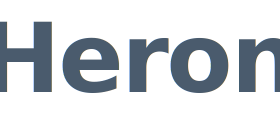
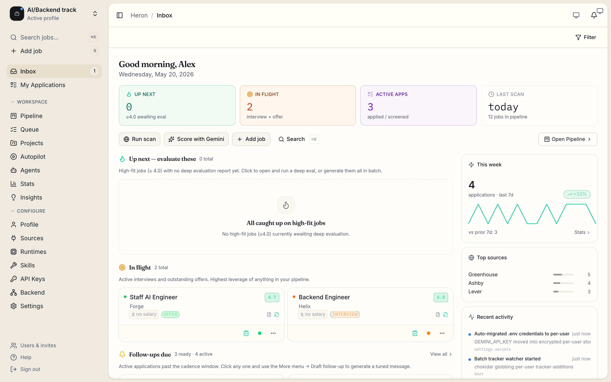
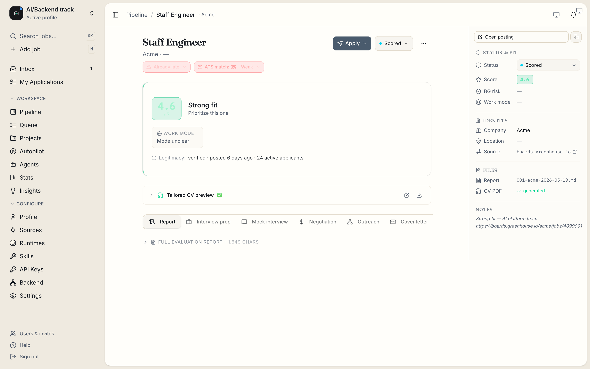
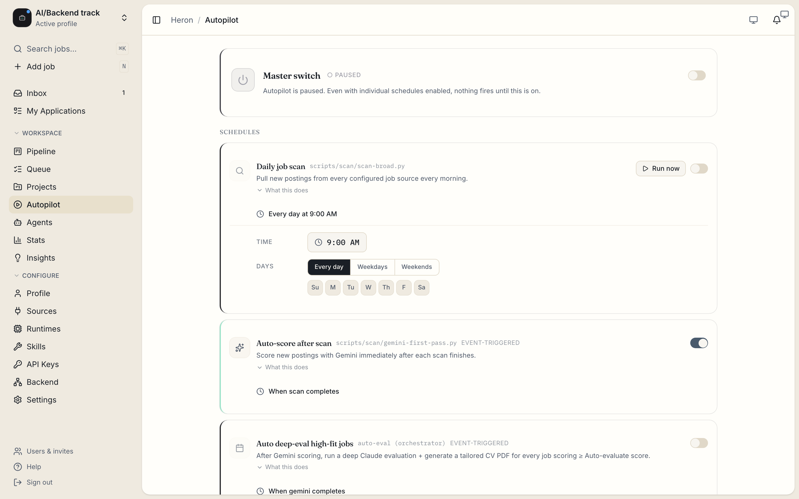
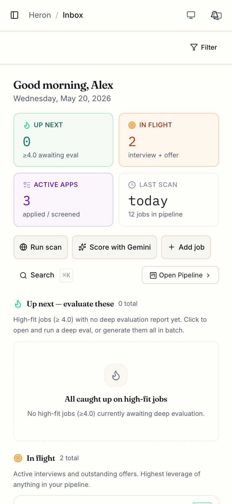

<div align="center">

<picture>
  <source media="(prefers-color-scheme: dark)" srcset="branding/assets/wordmark-light.svg">
  
</picture>

<!-- AUTO-GENERATED:doc-meta -->
*[Heron](https://heron.app) · Stand still. Strike well.*
<!-- /AUTO-GENERATED:doc-meta -->

**A thinking partner for career transitions. Local-first. Open source. AI-agnostic.**

[](https://github.com/kaelys-js/heron/actions/workflows/test.yml)
[](https://github.com/kaelys-js/heron/actions/workflows/codeql.yml)
[](https://codecov.io/github/kaelys-js/heron)
[](https://securityscorecards.dev/viewer/?uri=github.com/kaelys-js/heron)
[](LICENSE)
[](https://github.com/kaelys-js/heron/releases)
[](https://discord.gg/8pRpHETxa4)
[](https://reuse.software)

[**Quick start**](#quick-start) · [**Documentation**](docs/) · [**Architecture**](docs/ARCHITECTURE.md) · [**FAQ**](docs/FAQ.md) · [**Discord**](https://discord.gg/8pRpHETxa4) · [**Sponsor**](https://github.com/sponsors/kaelys-js)

</div>

---

## What is Heron

The Heron stands motionless in shallow water. It waits. It watches. It evaluates every passing form. Then, when the moment is exactly right, it strikes -- once, precisely, and the work is done.

This is the wrong era for spray-and-pray job searches. Recruiters' attention is finite. So is yours. Heron is a thinking partner for people in career transition who'd rather make one excellent move than fifty mediocre ones.

It runs entirely on your machine. Your data is yours. See [`docs/PHILOSOPHY.md`](docs/PHILOSOPHY.md) for the full posture.

## See it in action

<div align="center">

<picture>
  <source media="(prefers-color-scheme: dark)" srcset="docs/screenshots/inbox-dark.png">
  
</picture>

**Inbox** -- triaged opportunities by score, sortable, multi-profile

<br />



**A-F evaluation** -- six-block analysis per role (fit, CV match, level, comp, personalization, prep)

<br />

&nbsp;

**Autopilot** -- score-gated, daily-capped, opt-in &nbsp;·&nbsp; **Mobile** -- iOS / Android via Capacitor

</div>

## What it does

- **Pipeline + A-F evaluation** -- every opportunity tracked with a six-block analysis (role fit, CV match, level strategy, comp research, personalization plan, interview prep). Multi-profile if you run parallel career tracks.
- **CV generation** -- ATS-optimized PDFs tailored per role, with AI-detect + keyword check baked in.
- **Portal scanning** -- 11 ATSes (Greenhouse, Ashby, Lever, LinkedIn, Indeed, Workday, Recruitee, SmartRecruiters, Workable, Personio, Teamtailor) hit directly via their APIs -- zero AI tokens on scan.
- **Recruiter inbound + interview prep** -- Gmail IMAP poller classifies offers; STAR+R stories ready when a screen lands.
- **Autonomous apply (opt-in, off by default)** -- score-gated, daily-capped, falls back to manual the moment anything looks off. Native everywhere via Capacitor (iOS / Android) + Electron (Mac/Win/Linux) + Apple Watch.

## Pricing

Heron is MIT-licensed and free -- `$0/month, forever` if you use a Claude Max plan via `AGENT_CLI=claude`. See [`docs/FAQ.md`](docs/FAQ.md) for the cost breakdown including direct API tokens and the optional Apple Developer Program fee for iOS builds.

## Quick start

<details open><summary><b>macOS / Linux</b></summary>

```bash
brew install mise gh                              # one-time, if not installed
gh repo clone kaelys-js/heron && cd heron
mise install                                      # Node 26 + pnpm 11 + Ruby 3.3 + Python 3.13
pnpm install                                      # one-shot install across workspaces
pnpm setup:native                                 # optional — Capacitor iOS/Android/Electron setup
pnpm dev                                          # SvelteKit dashboard at localhost:5173
```

</details>

<details><summary><b>Windows</b></summary>

```powershell
scoop install mise gh                              # via Scoop
gh repo clone kaelys-js/heron; cd heron
mise install                                       # Node 26 + pnpm 11 + Ruby 3.3 + Python 3.13
pnpm install
pnpm setup:native                                  # optional
pnpm dev                                           # SvelteKit dashboard at localhost:5173
```

</details>

See [`docs/SETUP.md`](docs/SETUP.md) for the long form including Capacitor / iOS / Apple Watch builds, fastlane signing, and the `pnpm doctor:native` preflight check.

## Documentation

| Topic | Where |
|---|---|
| **Philosophy** (local-first, quality-over-volume) | [`docs/PHILOSOPHY.md`](docs/PHILOSOPHY.md) |
| **Architecture** (data flow, backend discovery, tech stack, repo layout) | [`docs/ARCHITECTURE.md`](docs/ARCHITECTURE.md) |
| **FAQ** (cost, auto-apply, privacy, supported ATSes) | [`docs/FAQ.md`](docs/FAQ.md) |
| **Comparable tools** (JobScan / Teal / AIHawk and where Heron sits) | [`docs/COMPARISON.md`](docs/COMPARISON.md) |
| **Setup** (Capacitor, iOS, Watch, signing) | [`docs/SETUP.md`](docs/SETUP.md) |
| **Development** (daily commands, branding SSOT, release flow) | [`.github/CONTRIBUTING.md`](.github/CONTRIBUTING.md) |
| **Testing** (Vitest matrix, coverage gates) | [`docs/TESTING.md`](docs/TESTING.md) |
| **Data contract** (per-user / per-profile layout, what's auto-updated) | [`docs/DATA_CONTRACT.md`](docs/DATA_CONTRACT.md) |
| **Governance + trademark** | [`docs/GOVERNANCE.md`](docs/GOVERNANCE.md), [`docs/TRADEMARK.md`](docs/TRADEMARK.md) |

## Community

| Channel | Use for |
|---|---|
| 💬 [Discord](https://discord.gg/8pRpHETxa4) | Real-time questions, setup help, show-and-tell -- typically same-day during EU/US working hours |
| 📚 [GitHub Discussions](https://github.com/kaelys-js/heron/discussions) | Async Q&A + ideas + roadmap + success stories |
| 🐛 [Issues](https://github.com/kaelys-js/heron/issues) | Bugs + feature requests (use the templates) |
| 🎓 [I got hired](https://github.com/kaelys-js/heron/issues/new?template=i-got-hired.yml) | Tell the Hall of Fame your story |
| 📰 [Press kit](branding/PRESS.md) | Pre-written boilerplate for journalists + bloggers |
| 🔒 [Security disclosure](.github/SECURITY.md) | Private vulnerability reporting (NOT public issues) |

See [`.github/SUPPORT.md`](.github/SUPPORT.md) for the "where should I ask this?" routing matrix.

## Security

Heron's security posture covers Better Auth + cookies, CSP + DOMPurify, rate limiting, path-traversal guards, audit logging, multi-user IDOR prevention, OSSF Scorecard, CodeQL across TS+Python+Swift, SLSA L2 build provenance attestations, lockfile-lint, license-compliance, TruffleHog secret-scanning, StepSecurity harden-runner, SHA-pinned actions, branch-protection rulesets, signed commits + DCO.

See [`.github/SECURITY.md`](.github/SECURITY.md) for the full posture + vulnerability disclosure flow.

## Contributing

We welcome PRs. Start with [`.github/CONTRIBUTING.md`](.github/CONTRIBUTING.md) -- covers the contributor ladder (Participant → Contributor → Triager → Reviewer → Maintainer), commit-message rules, DCO sign-off, and the "what we do NOT accept" list.

Issues labeled [`good first issue`](https://github.com/kaelys-js/heron/labels/good%20first%20issue) are scoped for first-time contributors. Join [Discord](https://discord.gg/8pRpHETxa4) before opening a feature PR -- saves you scope-rework.

### Contributors

<a href="https://github.com/kaelys-js/heron/graphs/contributors">
  
</a>

This project follows the [all-contributors](https://allcontributors.org) specification. Non-code contributions (docs, design, translation, ideas, infrastructure) count. See [`.all-contributorsrc`](.all-contributorsrc).

### Sponsors

Heron is built in volunteer time. If it saves you a job-search week, consider [sponsoring](https://github.com/sponsors/kaelys-js). Sponsors get a thank-you in `CHANGELOG.md` + a Discord role.

## Acknowledgements

Original work © 2026 santifer, MIT-licensed. See [`REUSE.toml`](REUSE.toml) for the full SPDX attribution.

## License

[MIT](LICENSE) for code. [CC-BY-4.0](https://creativecommons.org/licenses/by/4.0/) for `branding/*` (logos, mascot specs, voice guide). [CC0-1.0](https://creativecommons.org/publicdomain/zero/1.0/) for `docs/examples/*`. See [`REUSE.toml`](REUSE.toml) for the full SPDX declaration.

This fork © resist.js.

See [`docs/TRADEMARK.md`](docs/TRADEMARK.md) for trademark policy, [`docs/LEGAL_DISCLAIMER.md`](docs/LEGAL_DISCLAIMER.md) for usage disclaimers, and [`docs/GOVERNANCE.md`](docs/GOVERNANCE.md) for contribution governance.

---

<div align="center">

Maintained by [@kaelys-js](https://github.com/kaelys-js).
[Sponsor](https://github.com/sponsors/kaelys-js) ·
[Press kit](branding/PRESS.md) ·
[Discord](https://discord.gg/8pRpHETxa4) ·
[hello@heron.app](mailto:hello@heron.app)

MIT licensed.

</div>
