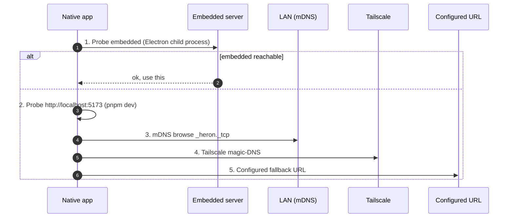

# Architecture

<!-- AUTO-GENERATED:doc-meta -->
*Part of the [Heron](../README.md) docs.*
<!-- /AUTO-GENERATED:doc-meta -->

## System Overview

```text
                    ┌─────────────────────────────────┐
                    │         AI Coding CLI Agent      │
                    │   (reads AGENTS.md + modes/*.md) │
                    └──────────┬──────────────────────┘
                               │
            ┌──────────────────┼──────────────────────┐
            │                  │                       │
     ┌──────▼──────┐   ┌──────▼──────┐   ┌───────────▼────────┐
     │ Single Eval  │   │ Portal Scan │   │   Batch Process    │
     │ (auto-pipe)  │   │  (scan.md)  │   │   (batch-runner)   │
     └──────┬──────┘   └──────┬──────┘   └───────────┬────────┘
            │                  │                       │
            │           ┌──────▼──────┐          ┌────▼─────┐
            │           │ pipeline.md │          │ N workers│
            │           │ (URL inbox) │          │ (headless)
            │           └─────────────┘          └────┬─────┘
            │                                          │
     ┌──────▼──────────────────────────────────────────▼──────┐
     │                    Output Pipeline                      │
     │  ┌──────────┐  ┌────────────┐  ┌───────────────────┐  │
     │  │ Report.md│  │  PDF (HTML  │  │ Tracker TSV       │  │
     │  │ (A-F eval)│  │  → Puppeteer)│  │ (merge-tracker)  │  │
     │  └──────────┘  └────────────┘  └───────────────────┘  │
     └────────────────────────────────────────────────────────┘
                               │
                    ┌──────────▼──────────┐
                    │  data/applications.md │
                    │  (canonical tracker)  │
                    └──────────────────────┘
```

## Evaluation Flow (Single Offer)

1. **Input**: User pastes JD text or URL
2. **Extract**: Playwright/WebFetch extracts JD from URL
3. **Classify**: Detect archetype (1 of 6 types)
4. **Evaluate**: 6 blocks (A-F):
   - A: Role summary
   - B: CV match (gaps + mitigation)
   - C: Level strategy
   - D: Comp research (WebSearch)
   - E: CV personalization plan
   - F: Interview prep (STAR stories)
5. **Score**: Weighted average across 10 dimensions (1-5)
6. **Report**: Save as `reports/{num}-{company}-{date}.md`
7. **PDF**: Generate ATS-optimized CV (`scripts/cv/generate-pdf.mjs`)
8. **Track**: Write TSV to the active profile's `batch/tracker-additions/`, auto-merged

## Batch Processing

The batch system processes multiple offers in parallel:

```text
batch-input.tsv    →  batch-runner.sh  →  N × headless CLI workers
(id, url, source)     (orchestrator)       (self-contained prompt)
                           │
                    batch-state.tsv
                    (tracks progress)
```

Each worker is a headless AI CLI instance — the bundled `batch-runner.sh` invokes `claude -p`, but the architecture supports any CLI's headless mode (see the Headless / Batch Mode table in `AGENTS.md` for the correct command per CLI). Workers produce:
- Report .md
- PDF
- Tracker TSV line

The orchestrator manages parallelism, state, retries, and resume.

## Data Flow

```text
cv.md                    →  Evaluation context
article-digest.md        →  Proof points for matching
config/profile.yml       →  Candidate identity
portals.yml              →  Scanner configuration
data/states.yml     →  Canonical status values
templates/cv-template.html → PDF generation template
```

## File Naming Conventions

- Reports: `{###}-{company-slug}-{YYYY-MM-DD}.md` (3-digit zero-padded)
- PDFs: `cv-candidate-{company-slug}-{YYYY-MM-DD}.pdf`
- Tracker TSVs: `<profile>/batch/tracker-additions/{id}.tsv` (per-profile, under the active user)

## Pipeline Integrity

Scripts maintain data consistency:

| Script | Purpose |
|--------|---------|
| `scripts/tracker/merge-tracker.mjs` | Merges batch TSV additions into applications.md |
| `pipeline.integration.test.ts` | Health check on every push: canonical statuses, duplicates, report links. Run locally with `pnpm test --filter=ui-integration`. |
| `scripts/tracker/dedup-tracker.mjs` | Removes duplicate entries by company+role |
| `scripts/tracker/normalize-statuses.mjs` | Maps status aliases to canonical values |
| `scripts/quality/cv-sync-check.mjs` | Validates setup consistency |

## Dashboard

The SvelteKit dashboard in `ui/` is the canonical UI: multi-profile pipeline,
tracker, Inbox issues, autonomous-apply controls, autopilot config, and the
agent-chat panel. Wrapped via Capacitor 8 for iOS/Android and Electron 39 for
macOS/Windows/Linux.

A standalone Go TUI lived in `dashboard/` historically — it was removed once
the SvelteKit UI reached feature parity (see commit history).

## Backend discovery

The dashboard is a single SvelteKit app. The native apps are the same SvelteKit codebase wrapped in Capacitor (iOS / Android) or Electron (desktop). Backend discovery is hands-off — your phone, watch, and laptop reconcile to whichever Heron instance is reachable without configuration.



## Tech stack

| Layer | Tech |
|---|---|
| Dashboard UI | SvelteKit 2 + Tailwind 4 + bits-ui + Svelte 5 runes |
| Auth | Better Auth 1.6 + passkey + GitHub OAuth + invite codes (RBAC) |
| DB | Drizzle ORM + better-sqlite3 (WAL mode); `auth.db` + `app.db` |
| AI | Anthropic SDK + Google Gemini SDK + any CLI via `AGENT_CLI` |
| Portal scrape | Playwright 1.60 + direct ATS APIs (zero AI tokens on scan) |
| Desktop | Electron 39 + electron-builder + auto-update (Squirrel/Mac, Squirrel.Win, AppImage) |
| Mobile | Capacitor 8 (iOS + Android) + Swift Package Manager |
| Watch | WKApplication + WCSession + WidgetBundle |
| iOS widgets | 4 widgets (pipeline / next interview / top apply / inbox issues) |
| Build | mise + pnpm workspace + turborepo + biome + lefthook |
| CI | GitHub Actions on `macos-15`, `ubuntu-latest`, `windows-latest`; `act` for local |
| Release | Conventional Commits → release-please → native-release.yml → TestFlight + GitHub Release |

## Repository layout

```text
heron/
├── README.md                    # User-facing entry point
├── CHANGELOG.md                 # Release-Please-managed
├── AGENTS.md / CLAUDE.md / GEMINI.md  # Agent + human entry points
├── ui/                          # SvelteKit dashboard + Capacitor iOS/Android/Electron
│   ├── src/                     # routes/, lib/server/, lib/client/, lib/components/, hooks.server.ts
│   ├── e2e/                     # Playwright end-to-end smoke tests
│   ├── ios/                     # Capacitor iOS app + Watch + 3 extensions
│   ├── android/                 # Capacitor Android app
│   └── electron/                # Capacitor-Electron shell (workspace)
├── scripts/                     # apply, scan, cv, quality, tracker, native, system, lib
├── modes/                       # AI skill modes (evaluate, apply, scan, batch, …)
├── docs/                        # ARCHITECTURE, SETUP, TESTING, NATIVE, DATA_CONTRACT, GOVERNANCE, …
├── branding/                    # brand.json (SSOT) + logo.svg + wordmark variants
├── data/                        # Per-user runtime state (gitignored)
└── .github/                     # Workflows, issue/PR templates, CODEOWNERS, rulesets
```
